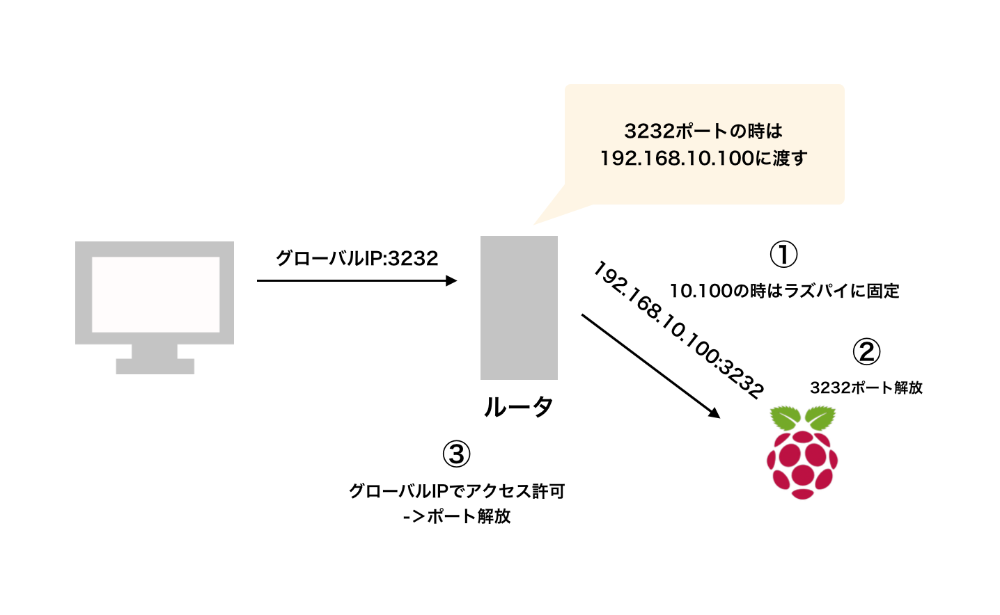

# ラズベリーパイを外部からSSHでアクセスする方法

## 目的
ラズパイを外部からSSHでアクセスする

## 方法

1. ラズパイに固定のプライベットネットーワークを固定する
2. ラズパイ側のポート解放
3. ルータのポート解放



## 注意
また有線でルータと接続させています．
ルータはAtermを用いています

## 1.ラズパイにプライベ−トIPアドレスを固定する

1. ラズパイにログイン
2. ```sudo vi /etc/dhcpcd.conf```で編集->一番最後に以下の文章(コメントアウト以外)を追記

```/etc/dhcpcd.conf
...
#有線の場合はeth0等
interface wlan0
#固定したいプライベートIPアドレス
#後々，Atermの場合はポート解放の際，プライベートIPアドレス192.168.10.XXのXXは機種によって，DHCPの自動割り当て範囲外に設定する必要があるため確認してください
#ex)http://www.aterm.jp/support/guide/category/enjoy/port/005/main.html
static ip_address=192.168.10.XX/24
#ゲートウェイ
static routers=192.168.XX.XX
# (ルータの設定ページにて)情報->現在の状態->拡張表示でDNSサーバを取得
static domain_name_servers=192.168.XX.XX

```

3. ```sudo reboot```で再起動


## 2.ラズパイ側のポート解放
今回はufwを用います（iptablesのラッパらしい)

1. ```sudo apt-get ufw ```でインストール
2. ```sudo ufw enable ```でufw起動
3. ```sudo ufw allow ssh ```でssh通信を起動
4. ```sudo ufw status ```　でポートが解放されているか確認

## 3.ルータのポート解放
ルータによっては設定の仕方が違うので注意してください

1. ```192.168.10.1```にブラウザでアクセスし設定ページを開く
2. 詳細設定->ポートマッピング設定
3. 先ほど設定したプライベートIPアドレスを指定して，開けるポートを書いて保存
4. [ここ](http://www.cman.jp/network/support/port.html)でポートが空いているか確認


## アクセスしてみる

```ssh pi@(グローバルIP)```

## おまけ

sshのポートをデフォルトの22で開けていると変なアクセスが多数来るため，変更しておいた方が良い
[ここ](https://webkaru.net/linux/change-ssh-port/)を参考にしたらできました

## 最後に

初めての事ばかりで戸惑いましたが，なんとかなりました．
セキュリティが最低限もできていないため，これからなんとかします．

Line Notifyやslackにログイン履歴を通知するようにしたので，なんかあったらすぐ消します笑

また，これから
- NextCloud
- vpn(大学のプロキシが面倒臭いため)
やっていきます
